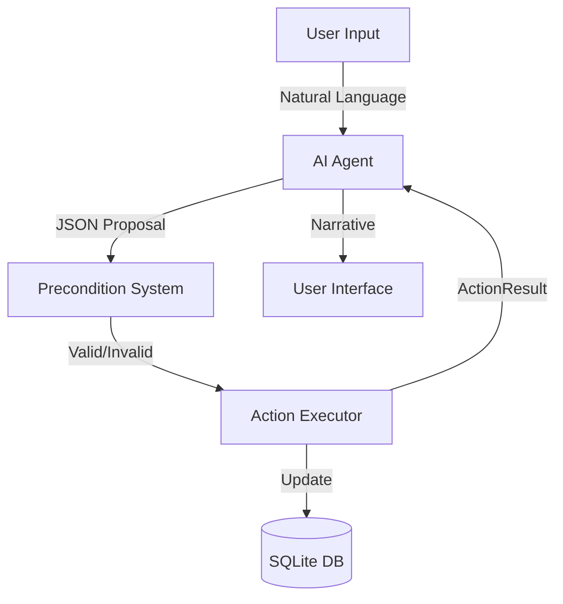

# 🎮 Game Overview & Architecture Status

## 🏗️ System Architecture

The game uses a **Neurosymbolic Architecture** combining a deterministic ECS engine with LLM-powered narrative generation.

### 1. Core Engine (ECS)
- **Source of Truth**: The Python engine is the absolute authority on game state.
- **Entities**: Pure IDs (Player=1, Goblin=2, etc.)
- **Components**: Pydantic models storing data (Stats, Location, Inventory, etc.)
- **Systems**: Logic processors (Movement, Combat, Validation)

### 2. AI Integration
- **Parser**: Ollama (qwen2.5:3b) converts natural language → JSON ActionProposal.
- **Validator**: PreconditionSystem checks if the proposal is physically possible.
- **Narrator**: Ollama generates descriptive text based on the ActionResult.

### 3. Data Flow


---

## 📂 Project Structure

```
GameBuild/
├── engine/                 # Core Game Engine
│   ├── core/              # ECS Implementation
│   │   ├── components.py  # Data structures
│   │   ├── entity.py      # Entity Manager
│   │   └── database.py    # SQLite Wrapper
│   ├── systems/           # Game Logic
│   │   ├── validation.py  # Physics/Rules Check
│   │   └── actions.py     # State Updates
│   └── ai/                # AI Integration
│       ├── ollama_agent.py # Local LLM Client
│       └── schemas.py     # Pydantic Models
├── data/                   # Game Data
│   └── world.db           # SQLite Database (Auto-generated)
├── docs/                   # Documentation
│   ├── architecture/      # Technical Docs
│   ├── benchmarks/        # AI Performance Tests
│   └── rules/             # Development Rules
├── tests/                  # Test Scripts
│   ├── test_ecs.py        # Unit Tests
│   └── demo_game.py       # Integration Tests
├── examples/               # Prototypes
│   └── nicegui_prototype.py # Old UI Prototype
├── scripts/                # Utility Scripts
│   └── setup_benchmark.bat
├── play.py                 # Main Game Entry Point
├── play_game.bat           # Quick Start Script
└── requirements.txt        # Dependencies
```

---

## 🧩 Current Features (Phase 1 & 2 Complete)

### ✅ Gameplay
- **Movement**: Navigate between rooms (North/South/East/West).
- **Interaction**: Take, Drop, Equip, Open, Close, Unlock.
- **Combat**: Attack enemies, calculate damage, death system.
- **Dialogue**: Talk to NPCs with context-aware responses.
- **Examination**: Look at objects and entities.

### ✅ Technical
- **Persistence**: Auto-save to SQLite.
- **Validation**: Prevents hallucinations (e.g., attacking dead enemies, walking through walls).
- **Performance**: Optimized for local execution on HP ZBook G7.

---

## 🚧 Roadmap

### Phase 3: Game Loop & World (Next)
- [ ] Complex Quest System
- [ ] World Map Generation
- [ ] Save/Load System (Manual)

### Phase 4: Advanced AI
- [ ] **ChromaDB Integration**: Semantic memory for lore and history.
- [ ] Long-term memory for NPCs.

### Phase 5: UI
- [ ] Web UI (SvelteKit + FastAPI).
- [ ] Real-time updates.

---

## 🛠️ How to Maintain

1. **Add Component**: Define in `engine/core/components.py`, register in `COMPONENT_REGISTRY`.
2. **Add Action**: Add schema in `ActionProposal`, validator in `PreconditionSystem`, executor in `ActionExecutor`.
3. **Update AI**: Modify prompts in `engine/ai/ollama_agent.py`.

